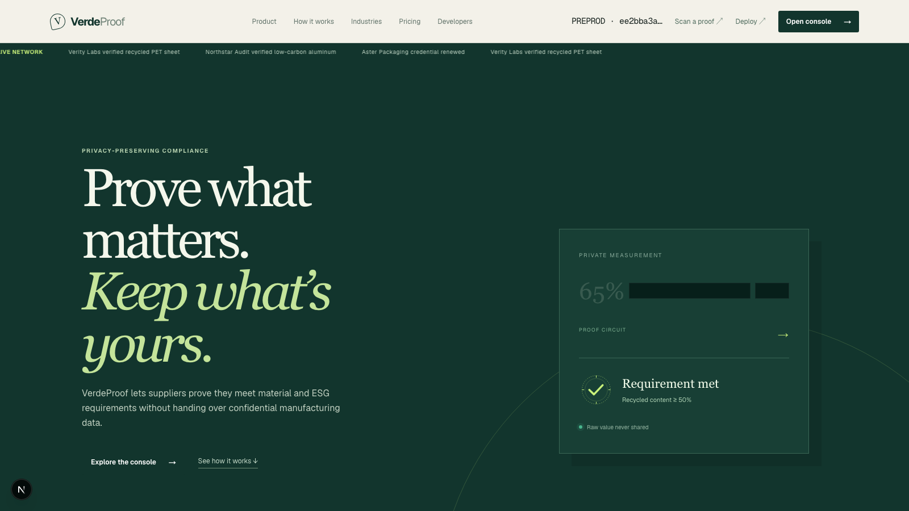
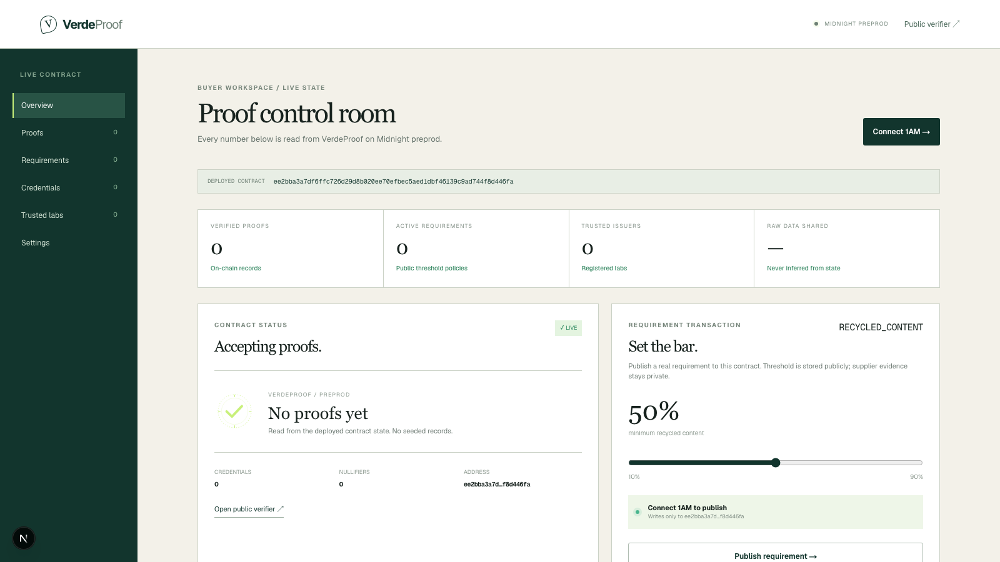
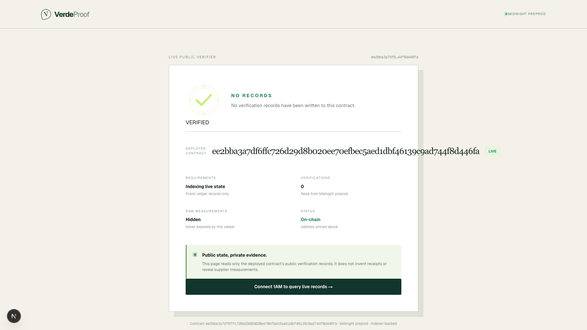

# VerdeProof

Privacy-preserving compliance proofs for supply chains.

[](https://github.com/BadAtVidya/VerdeProof/actions/workflows/ci.yml) [GitHub repository](https://github.com/BadAtVidya/VerdeProof)

VerdeProof lets a supplier prove that a product meets a buyer's sustainability or material requirement without exposing confidential manufacturing data. A trusted lab issues signed evidence, the supplier keeps the measurement private, and the buyer receives a verifiable on-chain result.

## Links

| Resource | Link | Notes |
|---|---|---|
| Product landing page | [Open locally](http://localhost:3000/) | Run `npm run dev` first |
| Buyer console | [Open locally](http://localhost:3000/app) | Live preprod contract state |
| Public verifier | [Open locally](http://localhost:3000/verify) | Reads public verification records |
| Browser deployment | [Open locally](http://localhost:3000/deploy) | Deploy through 1AM wallet |
| Demo video | [Watch on Google Drive](https://drive.google.com/file/d/1I5y61NCnGFgnaaJU9TE7HtSNmJ-HCPMQ/view?usp=sharing) | Product walkthrough |
| Product proposal | [`PROPOSAL.md`](./PROPOSAL.md) | Product and privacy design |
| Proposal alias | [`proposals.md`](./proposals.md) | Short proposal reference |
| Compact contract README | [`contracts/README.md`](./contracts/README.md) | Contract setup and commands |
| Contract source | [`verdeproof.compact`](./contracts/src/verdeproof.compact) | Main Compact contract |
| Contract tests | [`verdeproof.spec.ts`](./contracts/test/verdeproof.spec.ts) | Vitest contract suite |
| CI workflow | [`ci.yml`](./.github/workflows/ci.yml) | Compile, test, lint, build |
| Midnight documentation | [Open Midnight Docs](https://docs.midnight.network/) | Platform reference |

## The problem

Compliance workflows repeatedly ask suppliers to send test reports, formulations, certificates, and audit documents to every buyer. The buyer needs a narrow answer — for example, “is recycled content at least 50%?” — but receives the supplier's entire confidential record.

That creates duplicated work, stale documents, excessive disclosure, and weak verification of certificates.

## The solution

VerdeProof changes document sharing into reusable proof sharing:

```text
Trusted lab tests product
        ↓
Lab issues signed credential
        ↓
Supplier keeps evidence private
        ↓
Supplier proves requirement in a ZK circuit
        ↓
Buyer sees: requirement met ✓
```

Example: the buyer sets `recycled content ≥ 50%`. The supplier may hold a private value of 65%, but the public result contains only the policy, credential commitment, issuer metadata, validity/revocation status, and pass/fail result. The raw 65% is not disclosed by default.

## Approved Level 3 idea

This project implements the provided **Confidential Credentials** idea: prove that a credential is valid without disclosing the underlying evidence.

See the complete product proposal in [`PROPOSAL.md`](./PROPOSAL.md).

## Privacy model

### Publicly observable

- Deployed contract address
- Buyer requirements: metric, threshold, direction, and validity window
- Registered lab metadata and active status
- Credential commitment and non-sensitive metadata
- Credential expiry/revocation status
- Verification result and challenge nullifier
- Fields the supplier explicitly chooses to disclose

### Private by default

- Measured value, such as the actual recycled-content percentage
- Raw laboratory report and report hash
- Commitment nonce/blinding material
- Lab Schnorr signature input
- Admin, lab, supplier, and buyer secret keys
- Private witness state used during proof generation

The verifier can confirm the result without learning the underlying measurement. Selective disclosure is explicit: the supplier chooses whether to reveal a value or report hash.

## Contract details

### Network

- Network: Midnight preprod
- Wallet: 1AM browser extension
- Deployment: browser wallet only
- Proof generation: wallet proving/provider flow
- Server-side funded deployer: none
- Local proof server: not required in the main flow

### Deployed contract

```text
ee2bba3a7df6ffc726d29d8b020ee70efbec5aed1dbf46139c9ad744f8d446fa
```

The frontend is pinned to this address in [`lib/contract.ts`](./lib/contract.ts). Console writes and verifier reads target this contract only.

### Core circuits

| Circuit | Purpose |
|---|---|
| `manageAdmin` | Pause the contract or transfer administration |
| `manageLab` | Register, update, activate, or remove a trusted lab |
| `createRequirement` | Publish a buyer-defined threshold and validity window |
| `issueCredential` | Commit lab evidence after in-circuit signature verification |
| `revokeCredential` | Revoke a credential by its lab or platform admin |
| `presentComplianceProof` | Prove a valid credential meets a private threshold |
| `presentDisclosure` | Prove credential validity with supplier-selected disclosure |

### Pure SDK circuits

- `deriveAdminKey`
- `deriveSupplierKey`
- `deriveLabOperatorKey`
- `deriveBuyerKey`
- `isKnownMetric`
- `evidenceChallenge`

### Supported metrics

- Recycled content
- Carbon intensity
- Restricted chemicals
- Renewable energy
- Responsible sourcing
- Certification
- ESG score

Percentage-style metrics use basis points: `5,000 = 50%`.

### Why seven circuits?

The preprod network currently has conservative block-resource limits. The deployed MVP keeps seven core circuits so the contract can fit within the deployment budget. Public read-only views are decoded from indexed ledger state instead of adding extra on-chain query circuits.

## Frontend

### `/`

Marketing landing page explaining the product, privacy model, industries, pricing model, SDK concept, and compliance workflow.

### `/app`

Live buyer console. It:

- Connects to 1AM on preprod
- Reads contract state from the Midnight indexer
- Shows live counts for labs, requirements, credentials, proofs, and nullifiers
- Shows the deployed contract address
- Publishes a real `createRequirement` transaction through the wallet
- Never seeds fabricated records

### `/verify`

Live public verifier. It reads verification records from the deployed contract and shows an honest empty state when no proof has been written.

### `/deploy`

Browser-only deployment flow following the 1AM wallet pattern. It explicitly sets `preprod`, loads generated ZK assets, uses wallet proving/balancing/submission, and displays the resulting contract address.

### `/proofs`, `/requirements`, `/credentials`, `/labs`, `/settings`

Route-aware console views backed by the same deployed contract state and address.

## Screenshots

All captures below are real landscape `1600 × 900` screenshots from the running app.

| Landing page | Live console | Live verifier |
|---|---|---|
|  |  |  |

## How to run locally

### Prerequisites

- Node.js 22+
- 1AM browser extension
- Midnight preprod wallet with tDUST for transactions
- Compact CLI on `PATH` for contract compilation

### Install

```bash
npm install
cd contracts
npm install
cd ..
```

### Compile contract and copy ZK assets

```bash
cd contracts
npm run compact
cd ..
mkdir -p public/zk/verdeproof
cp -Rf contracts/src/managed/verdeproof/keys public/zk/verdeproof/
cp -Rf contracts/src/managed/verdeproof/zkir public/zk/verdeproof/
```

### Start the app

```bash
npm run dev
```

Open [http://localhost:3000/](http://localhost:3000/).

## How to use the live console

1. Open `/app`.
2. Select **Midnight preprod** in 1AM.
3. Click **Connect 1AM**.
4. Confirm the displayed contract address matches the address above.
5. Set a recycled-content threshold with the slider.
6. Click **Publish requirement**.
7. Approve the wallet transaction.
8. Refresh after indexer propagation; the live requirement count should increase.
9. Open `/verify` to inspect live verification state.

The current deployed contract has no fabricated labs, credentials, or proofs. A complete credential proof requires a registered lab, signed private evidence, and supplier witness state.

## Browser deployment flow

The deployment flow is intentionally client-side:

1. Detect `window.midnight["1am"]`.
2. Connect with `wallet.connect("preprod")`.
3. Set the Midnight network ID before wallet or contract operations.
4. Load verifier/prover assets from `/public/zk/verdeproof`.
5. Request the proving provider from 1AM.
6. Create the unproven deployment transaction.
7. Let the wallet balance, prove, sign, and submit it.
8. Display the deployed contract address.

No funded server wallet is used. Private state is persisted locally in the browser so subsequent wallet sessions can reuse the same witness state.

## Development commands

| Command | What it does |
|---|---|
| `npm run dev` | Starts Next.js development server |
| `npm run build` | Creates production build |
| `npm run lint` | Runs ESLint |
| `npm test` | Compiles contract and runs contract tests |
| `npm run test:contract` | Runs the contract test suite |
| `cd contracts && npm run compact` | Regenerates Compact managed artifacts and ZK files |
| `cd contracts && npm run typecheck` | Typechecks contract-side TypeScript |

## Tests

The contract suite covers:

- Circuit surface and generated contract compatibility
- Deterministic role identity derivation
- Witness input validation and 32-byte privacy boundaries
- Missing evidence rejection
- Evidence range and expiry validation
- Schnorr challenge reduction
- Public/private ledger separation
- In-circuit signature verification
- Expiry, revocation, threshold direction, nullifier, and multi-lab source guarantees

Latest local result: **16 tests passed**.

```bash
npm test
```

## CI/CD

[`/.github/workflows/ci.yml`](./.github/workflows/ci.yml) runs on every push to `main` and every pull request:

1. Installs Node.js 22 and Compact CLI.
2. Installs contract dependencies.
3. Compiles the Compact contract.
4. Runs the contract tests.
5. Installs app dependencies.
6. Runs lint.
7. Runs the production build.

The workflow is intentionally validation-only: deployment remains a user-approved browser-wallet operation on `/deploy`.

## Demo video script — 60 seconds

1. Landing page: explain “prove what matters, keep what's yours.”
2. Open `/app` and point to the deployed preprod contract address.
3. Connect 1AM.
4. Set `recycled content ≥ 50%`.
5. Approve **Publish requirement** in the wallet.
6. Show the live requirement count after indexer refresh.
7. Open `/verify` and show that no fake proof records are present.
8. Explain the next privacy-preserving lifecycle: trusted lab credential → private supplier proof → buyer sees only `PASSED`.

Do not claim a credential or proof exists on-chain unless the corresponding transaction has actually been submitted and indexed.

## Troubleshooting

### 1AM is not detected

Install the extension, select preprod, reload the page, and ensure the extension exposes `window.midnight["1am"]`.

### Wrong network

The app rejects any wallet configuration that does not return `preprod`. Select Midnight preprod in 1AM before connecting.

### Contract state is unavailable

Wait for the preprod indexer to observe the deployment, then refresh. Confirm the address exactly matches the deployed address above.

### Transaction exhausts block limits

The contract was reduced to seven core circuits for the current preprod deployment budget. Regenerate the managed bundle and ZK assets after changing Compact source; do not submit an old asset bundle against the new contract.

### No credentials or proofs appear

This is expected until the lab issuance and supplier presentation transactions have been completed. The UI intentionally displays zero live records instead of sample data.

## Repository structure

```text
app/                         Next.js routes
components/                  Landing, console, deploy, and verifier UI
contracts/src/verdeproof.compact  Compact contract source
contracts/src/witnesses.ts   Private witness validation
contracts/test/              Vitest contract tests
lib/contract.ts              Deployed address and indexer state decoding
lib/deploy.ts                Wallet-backed deployment and requirement write
lib/midnight.ts              1AM preprod providers and private state
public/screenshots/          README evidence screenshots
public/zk/verdeproof/        Generated proving/verifier assets
PROPOSAL.md                  Level 3 product proposal
.github/workflows/ci.yml     CI pipeline
```

## License

Private hackathon/demo project. Add a project license before public reuse.
